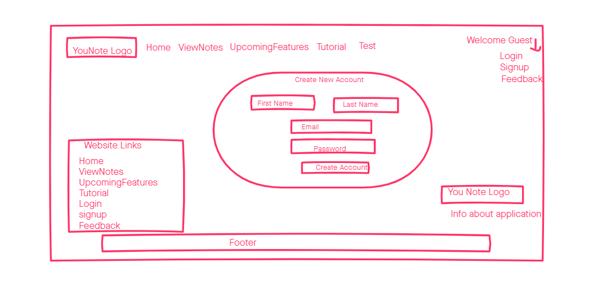
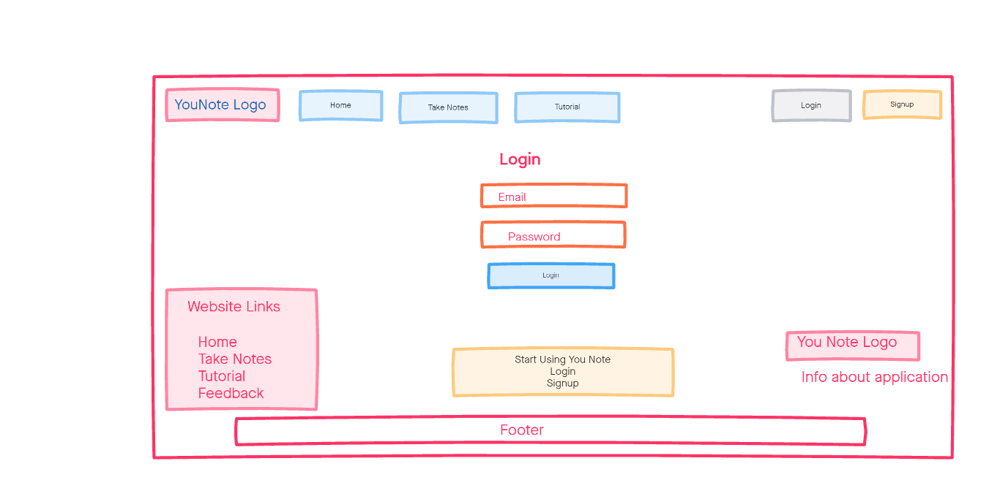
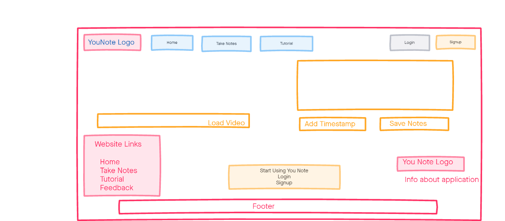

# Requirements & Specification Document: Iteration 1

## Project Abstract
YouNote is a web application which allows users to take and save notes on YouTube videos, where each note is associated with a timestamp in the video. Notes are written in a text input within a form, which also contains a “time” input for the timestamp and are located besides an embedded video in the same window. The notes can be saved by clicking a button to submit the form only if the user is logged into an account to associate the note with the account. In a page to view and share saved notes, admin accounts can modify or delete saved notes from their own account and standard accounts, whereas standard accounts can modify and delete their own saved notes.

## Customer
Our target audience is any individual who wishes to gain knowledge from the vast library of publicly available videos on YouTube and want a note-taking software integrated with a YouTube video. This solves the problem of needing to search through libraries of watched content to find the video section referenced by a particular note they took. For example, a student studying remotely with access to recorded YouTube lecture videos would benefit from being able to watch lectures and take time stamped notes simultaneously on the same page.

## Competitive Analysis
For what has already been implemented, Google Chrome extensions, such as “TubersLab - Youtube Notepad'', “Rocket Note”, and “YouNoteIt”, are applications with the ability to take notes while having the video open on YouTube. Although their goal is the same as our application, our web app instead displays the video and note input on our website instead of on YouTube. There are no web apps that can be easily found that implements our idea. Moreover, YouNote will give users an option to save, edit and share the notes as well. Users will have to create an account, allowing them to save their notes securely in their account for future use.

## User Stories

### Iteration 1: Signup and login for regular users
* Alex (User) is a university student who wishes to take notes while watching a YouTube video of his instructor using YouNote. As he is a new user to the application, he will first sign up to make an account in YouNote. By clicking on the “Signup” button, he will see text fields where he registers his first name, last name, and email; and inputs his desired password. After entering this information, he clicks the “Create my account” button to register his account.
  * After creating an account, he can log in to his account by entering his registered email and password in the text fields provided and then click on the “Log In” button. Once logged in, it will show “Welcome Alex” indicating he has logged into his account. There will be a “Logout” button in the top-right dropdown menu which he can click to logout of his account.

### Iteration 1: Login for admin user
* A default admin account will automatically be created when the application starts. If the admin wants to access his account in YouNote, he enters the email and password of the admin account in the login page and clicks the “Log In” button. Once the admin is logged in, the page will show “Welcome admin” to indicate that the admin has logged in. An admin will also see an “Admin Dashboard” button. There is a “Logout” button which the admin can click to log out of his account.

### Iteration 1: Viewing Users database from admin account
* Once an admin logs into an admin account, he will be able to click on the “Admin Dashboard” to view information in the Users database, including the ID, first name, last name, email, and type of account. The admin will not be able to view the hashed password of accounts on the dashboard page for security purposes.

### Iteration 1: Tutorial, test page, and providing feedback
* Alex (User) wants to know how the application works, test it, and provide feedback about it.
He can click on the tutorial button on the homepage which will give him a brief description of the application and how to use it.
  * He will have an option to test it as well. He can click on the “Test” button to load a test page. This will show him a rough layout of what the application looks like and how it will work. It will have a search box where he can enter the URL of a YouTube video and click on “Load Video” to load an embedded video from the URL. On the test page, there is also a textbox where he can take notes while watching the video.
  * The test page currently does not have the option to save notes.
  * Clicking on the “Upcoming Features” button on the navigation bar allows Alex to view all upcoming features of the application.
  * Alex can give feedback on the app by clicking the “Feedback” link, found in both the dropdown menu and footer. The feedback page has an option for him to enter his first name, last name, and any suggestions he would like to provide about the app.

## User Stories for Iterations 2 and 3

### Iteration 2
* Users will be able to search for a video in the application.
* Users will have an option to save, edit, or share their notes.
* Notes will be associated with a timestamp in the video.
* Regular users will have an option to delete their own notes if they wish to.
* Admin users will have an option to modify or delete notes from standard accounts.
* Users can delete their own accounts.
* Admins can delete any regular account.
* Users can click on a “Forgot Password?” link to reset their passwords.

### Iteration 3
* Users will be able to unshare their videos and notes.
* Users, particularly instructors, will be able to share videos to multiple users at once.
* In the User's account, there will be a “Watched Videos” page which will show the history of videos for which the user has saved notes for.
* In the User's account, there will be a “Shared With Me” page which will show videos and notes that other users have shared.
* Users will be able to add videos and notes to their favorites.

## User Interface Requirements

### Mockup for Signup Page

### Mockup for Login Page

### Mockup for Test Page
