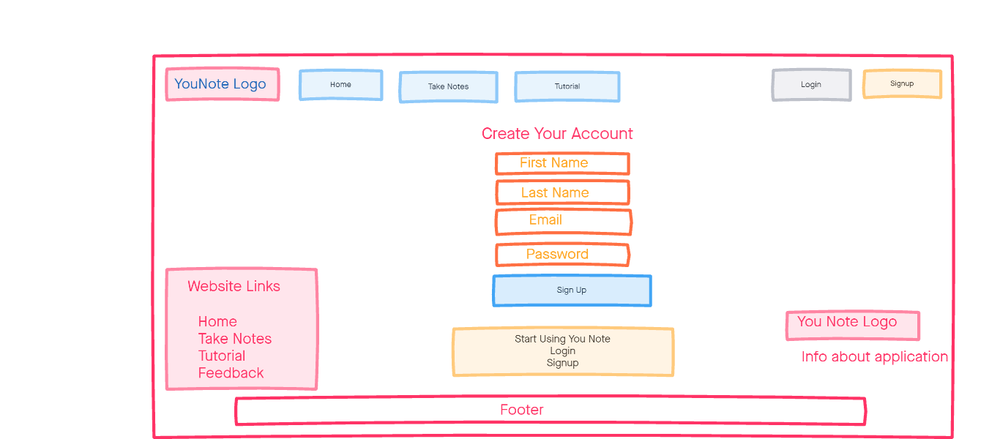
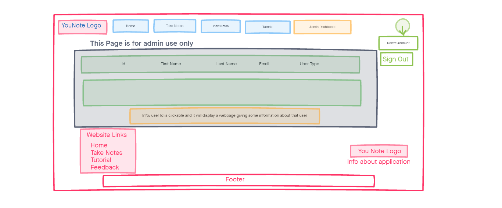

# YouNote Requirements & Specification Document: Iteration 2

## Project Abstract
YouNote is a web application which allows users to take and save notes on YouTube videos, where each note is associated with a timestamp in the video. Notes are written in a text input within a form, which also contains a “time” input for the timestamp and are located besides an embedded video in the same window. The notes can be saved by clicking a button to submit the form only if the user is logged into an account to associate the note with the account. In a page to view and share saved notes, admin accounts can modify or delete saved notes from their own account and standard accounts, whereas standard accounts can modify and delete their own saved notes.

## Customer
Our target audience is any individual who wishes to gain knowledge from the vast library of publicly available videos on YouTube and want a note-taking software integrated with a YouTube video. This solves the problem of needing to search through libraries of watched content to find the video section referenced by a particular note they took. For example, a student studying remotely with access to recorded YouTube lecture videos would benefit from being able to watch lectures and take time stamped notes simultaneously on the same page.

## Competitive Analysis
For what has already been implemented, Google Chrome extensions, such as “TubersLab - Youtube Notepad'', “Rocket Note”, and “YouNoteIt”, are applications with the ability to take notes while having the video open on YouTube. Although their goal is the same as our application, our web app instead displays the video and note input on our website instead of on YouTube. There are no web apps that can be easily found that implements our idea. Moreover, YouNote will give users an option to save, edit and share the notes as well. Users will have to create an account, allowing them to save their notes securely in their account for future use.

## User Stories

### Iteration 1: Signup
* Alex (User) is a university student who wishes to take notes while watching a YouTube video of his instructor using YouNote. As he is a new user to the application, he will first sign up to make an account in YouNote. By clicking on the “Signup” button, he will see text fields where he can register his first name, last name, email, and desired password. After entering this information, he clicks the “Create my account” button to register his account.
  * For error cases when submitting, not entering input in any of the text fields will display an error page with the first error encountered. Entering an invalid email will generate an appropriate error message. If the email has already been used to register for this application, an error message will indicate that the user already exists.

### Iteration 1: Login
* If Alex (User) wants to access his account in YouNote, he can click on the “Login” button on the navbar to access the login page. He then enters his account’s email and password and clicks the “Login” button. There is a “Sign out” button in the dropdown menu on the right side of the navbar which the admin can click to log out of his account.
  * For error cases when logging in, entering the incorrect credentials will redirect the user back to the login page with cleared inputs.
  * An appropriate error message will appear if Alex tries to submit with an invalid email format, or submits without text in the email address or password field.
  * A default admin account will automatically be created when the application starts. An admin will also see an “Admin Dashboard” button when they log in. The admin account is registered with an email “admin@younote.com” and password “admin”.

### Iteration 1: Admin can view users database
* Once an admin logs into an admin account, he will be able to click on the “Admin Dashboard” to view information in the users database, including the user ID, first name, last name, email, and type of account. The admin will not be able to view the hashed password of accounts on the dashboard page for security purposes.

### Iteration 1: Tutorial
* If Alex (User) wants to know how the application works, he can click on the ‘Tutorial’ button on the homepage which will give him a brief description of the application and how to use it.

### Iteration 1: Feedback
* Alex can give feedback on the app by clicking the “Feedback” link, found in both the dropdown menu and footer. The feedback page has an option for him to enter his first name, last name, and any suggestions he would like to provide about the app.

### Iteration 2: Admin can delete regular user accounts
* The admin has the ability to delete any regular user account. The admin must log in to their admin account and click on “Admin Dashboard” to see all user accounts, including their own. The admin can click on the user ID for a user to see a text input. Writing “DELETE” on this input and clicking on “Delete” will delete the user account. The admin is unable to delete their own or other admin accounts.

### Iteration 2: Admin can view and delete notes from user accounts
* After the admin has logged in to their admin account, clicking on “Admin Dashboard” and then clicking on a user ID will show all the saved notes for that user ID. The admin can then click on “Delete” on the row of a specific note to delete that note.

### Iteration 2: Save notes
* Alex (User) wishes to take notes and save it. He needs to log in first to be able to save notes. Once logged in, Alex clicks on the “Take Notes” tab to access the note-taking page. He then enters a URL for a Youtube Video on the appropriate text input and clicks the “Load Video” button to load the embedded video. Alex can then enter a title in the appropriate input and write notes in the large textbox. When Alex is done writing his notes, he clicks on “Save Notes” to save his notes.

### Iteration 2: Users can view and delete their notes
* After logging in, Alex (User) can view his saved notes by clicking on “View Notes” on the dropdown menu on the right side of the navbar. Clicking on “Delete” on the row for a note will delete that note.

### Iteration 2: Users can delete their account
* Suppose Alex (User) wants to delete his account. After Alex logs in, they can click on “User Dashboard”. Alex will then type “DELETE” in the input and click on the “Delete” button to delete his account. Afterwards, Alex will be logged out and his account will be deleted.

### Iteration 2: Included test cases for classes
* Test cases were included for the User, Note, and Timestamp classes using the JUnit framework.

## User Stories for Iteration 3

### Iteration 3
* Notes will be associated with a timestamp in the video.
* Admin users will have an option to modify or delete notes from standard accounts.
* Users will be able to search for a video in the application.
* Users can click on a “Forgot Password?” link to reset their passwords.
* Users will be able to edit and share their notes.
* Users will be able to unshare their videos and notes.
* Users, particularly instructors, will be able to share videos to multiple users at once.
* In the User's account, there will be a “Watched Videos” page which will show the history of videos for which the user has saved notes for.
* In the User's account, there will be a “Shared With Me” page which will show videos and notes that other users have shared.
* Users will be able to add videos and notes to their favorites.

## User Interface Requirements

### Mockup for Signup Page

### Mockup for Login Page

### Mockup for Test Page

### Mockup for View Notes Page

### Mockup for Admin Dasboard Page

### Mockup for Admin Access which is displayed when admin clicks id of a particular user
